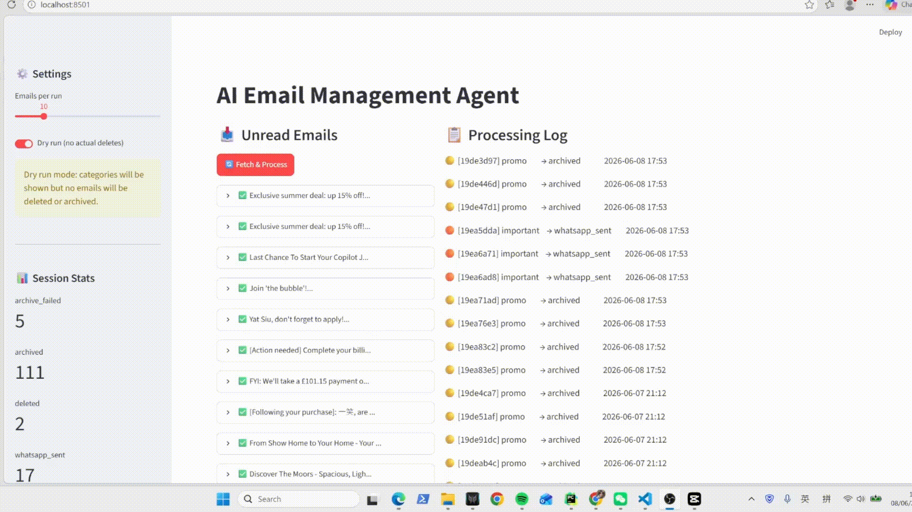

# 📧 AI Email Management Agent

> Automatically triage your inbox using LangGraph + GPT-4o-mini.  
> Spam gets deleted, promos get archived, important emails reach you on WhatsApp.

---

## DEMO


## How it works

```
Gmail (unread) → LLM Classifier → Action
                                  ├── spam       → Trash
                                  ├── promo      → Archive
                                  ├── important  → WhatsApp notification
                                  └── appointment→ WhatsApp + keep
```

1. Agent polls Gmail every 5 minutes for unread emails
2. LLM classifies each email into categories: `spam` / `promo` / `important` / `appointment`
3. then execute action automatically (trash, archive, or notify)
4. Reply to the WhatsApp message to **delete**, **keep**, or **reply** to the email

---

## Quick start

```bash
git clone https://github.com/your-username/ai-email-agent
cd ai-email-agent
pip install -r requirements.txt
cp .env.example .env          # then fill in your API keys
```

### First-time Gmail auth (opens browser once)

```bash
python main.py
```

### Start continuous monitoring

```bash
python main.py --watch
```

### Start the WhatsApp webhook server (separate terminal)

```bash
python webhook.py
```

### Launch the Streamlit dashboard

```bash
streamlit run app.py
```

---


## Environment variables

Create a `.env` file from `.env.example` and populate these:

```env
OPENAI_API_KEY=sk-...
GMAIL_CREDENTIALS_PATH=credentials.json
TWILIO_ACCOUNT_SID=...
TWILIO_AUTH_TOKEN=...
TWILIO_WHATSAPP_FROM=whatsapp:+14155238886
TWILIO_WHATSAPP_TO=whatsapp:+44...
```

---

## Requirements

- Python 3.10+
- A Gmail account with the Gmail API enabled ([guide](https://developers.google.com/gmail/api/quickstart/python))
- A Twilio account with WhatsApp sandbox access
- An OpenAI API key